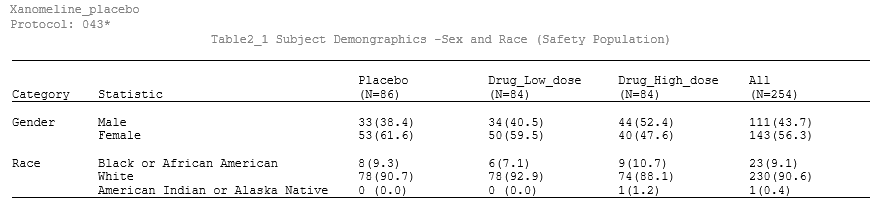

# Clinical SAS: Safety Population Demographics Table

## Overview
This repository contains a specialized SAS program designed to generate a Safety Population Demographic Table (Sex and Race). It utilizes ADaM `ADSL` data to produce a submission-ready RTF report. 

This project demonstrates proficiency in:
- Macro Variable Processing: Dynamic header population using `PROC SQL INTO:`.
- Data Restructuring: Complex data manipulation, merging, and `PROC TRANSPOSE` for clinical reporting.
- Reporting: Advanced `PROC REPORT` techniques including compute blocks and ODS RTF styling.

---

## 📊 Sample Output
Below is the clinical table generated by the `TABLE2.sas` script using the CDISC Pilot 101 ADSL data.

<p align="center">
  
</p>

> **Note:** The output follows the standard Table 14.1 layout, featuring N counts in headers and n (%) formatting for all demographic categories.

---


## Key Features
- Total Column Logic: Creates an "ALL" treatment group (TRT01AN=99) by duplicating safety population records.
- Dynamic Headers: Automatically calculates and displays sample sizes (N=XX) in column headers using macro variables.
- Zero-Fill Logic: An array-based post-processing step ensures that missing treatment cells are populated with `0 (0.0)` for clinical accuracy.
- Clinical Formatting: Standardized "Statistic" and "Category" alignment for Gender and Race variables.

---

## Repository Structure
```text
/sas-clinical-macro-library
│
├── /macros              <- External RTF styling macros (rtf.sas)
├── /programs            <- Main analysis script (TABLE2.sas)
├── /outputs             <- Final generated report (Safety_Population.rtf)
└── README.md            <- Project documentation
```


## Data Source
The datasets used in this project are derived from the **CDISC Pilot Study 101**. 

To maintain a clean repository and adhere to best practices, the raw `.sas7bdat` files are not hosted directly in this folder. However, they are publicly available and can be accessed through the following sources:

* **Internal Reference:** Data can be found within the `/data` folder of my other repository: [SAS-Graphs-Clinical-Trials-Example](https://github.com/vildaduan/SAS-Graphs-Clinical-Trials-Example)
* **Official Source:** The complete CDISC Pilot Study datasets are available on the [CDISC Website](https://www.cdisc.org).

### Required ADaM Variables
The `TABLE2.sas` script expects the `ADSL` dataset to contain:
- `USUBJID`: Unique Subject Identifier
- `SAFFL`: Safety Population Flag (Condition: `SAFFL="Y"`)
- `TRT01A / TRT01AN`: Analysis Treatment (Numeric & Character)
- `SEX / RACE`: Demographic variables


